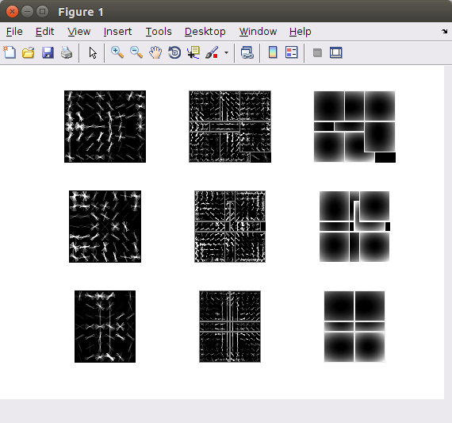
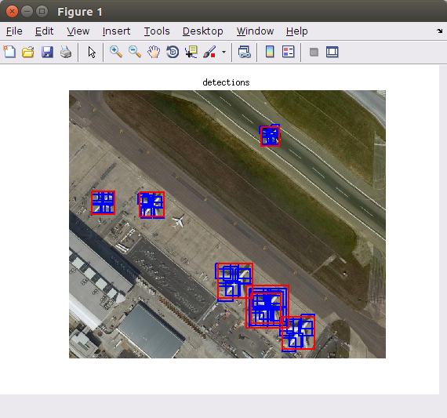
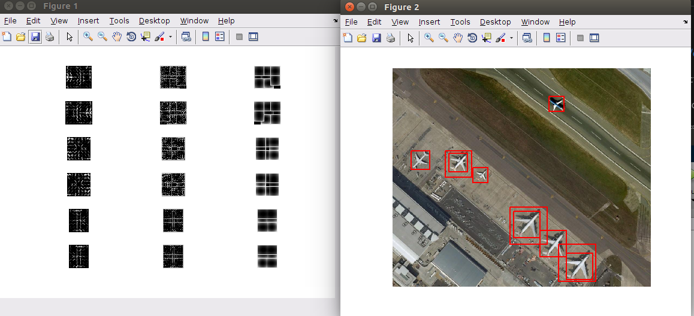

fork **voc-dpm (voc-release5)** https://github.com/rbgirshick/voc-dpm

train **NWPU-VHR-10-dataset** http://www.escience.cn/people/gongcheng/NWPU-VHR-10.html


系统要求：
===================
 * Linux
 * MATLAB (已经测试过2016 2014版本)
 * GCC (MATLAB2016版-gcc4.9 MATLAB2014版-gcc4.7)


新增的文件/文件夹说明：
===================
- AerialImages:使用DPM训练得到的模型文件

- mat2opencvxml.m：fork 
https://github.com/opencv/opencv_extra/tree/master/testdata/cv/dpm

- mat2opencvxml:使用mat2opencvxml.m将voc训练得到的代码转换为opencv_contrib中dpm支持的xml格式

- mat2opencvxml_401.m：来源于网络,适用于voc-release4版本的转换，和当前voc-release5不兼容

- data/pascal_data2.m：仿pascal_data.m文件新增，读取NWPU数据集的接口

- hdebug.m:训练前的数据处理、训练指令、测试训练模型等代码


NWPU-VHR-10检测结果：
===================
- airplane:运行demo.m





- airplane:

```matlab
%% detect
load('AerialImages/nwpu_airplane_final.mat');       
figure(1),visualizemodel(model)
im = imread('cachedir/nwpu-10/pos/002.jpg');       
bbox = process(im, model, -0.2);
figure(2),showboxes(im, bbox); 
```




***

[原始版本的README](./README(original))